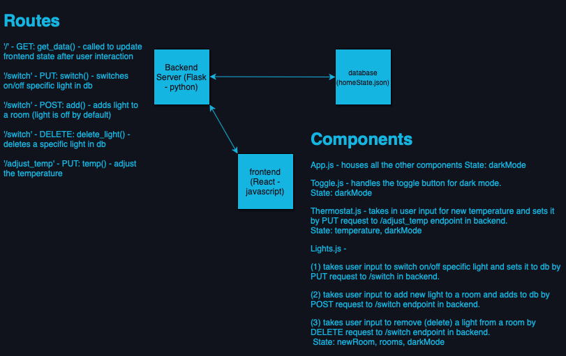

## Canoo Project

This is a project for Canoo.

## Stack

Frontend is React, backend in built with Flask. Please reference the architecture diagram below for more info.

I've also included a gif image below to show the app in action.

# Installation

To get the back end server running, you can run the following commands:

- `pipenv shell`
- `export FLASK_APP=backend.py`
- `flask run`

If running for development:

- `pipenv shell`
- `export FLASK_APP=backend.py`
- `export FLASK_ENV=development`
- `flask run`

Then you will want to get the frontend running:

- `cd src/`
- `npm install`
- `npm run start`
